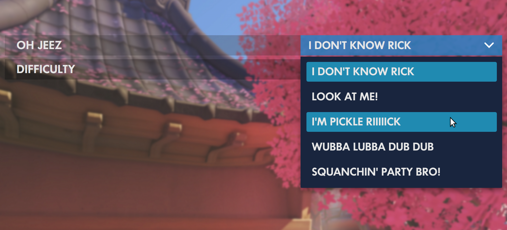

overwatch-settings-select
=========

A React component modeling the Overwatch Settings select element

## Install

Note: Requires **React 16.2+**

    npm install --save overwatch-settings-select
    
### Fonts

#### Futura No 2 D DemiBold

This font is used by Activision Blizzard for much of Overwatch's design. For this component **to match the Overwatch design, including the font is required**. It can be licensed from [MyFonts](http://www.myfonts.com/fonts/urw/futura-no-2/futura-no2-d-demi-bold/).

When using CSS font-face, the font-family should match whats below:

    font-family: 'Futura No 2 D DemiBold';

## Usage

Check out [example/index.js](example/index.js) for working example or below for exact usage.
    
    import SettingsSelect from 'overwatch-settings-select'
    
    class Example extends React.Component {
    
        state = {
            selectedIndex: 0,
        }
    
        onChange = (selectedIndex) => {
            this.setState({
                selectedIndex,
            })
        }
        
        render() {
            const { selectedIndex } = this.state
    
            return <SettingsSelect
                selectedIndex={selectedIndex}
                onChange={this.onChange}
                options={
                    [
                        'Easy',
                        'Medium',
                        'Hard',
                        'Baller',
                    ]
                }
                label={'Difficulty'}
            />
        }
    }

### Props

| name        | required | type           | default  | desc 
--- | --- | --- | --- | --- |
| onChange | **`X`**  | function | null | Callback method called when a new option is selected. Parameter is the new selectedIndex to be set in state in the parent component. |
| options | **`X`**  | array | null | Array of strings or Components to be displayed as options |
| selectedIndex | **`X`** | string | null | Index of the selected option, should be stored in parent state and changed during `onChange` |
| label | | string | null | Label for the component, positioned to the left of the options |

## Development

    npm run dev
  
#### Running the example

Install it:

    cd example/; npm install
    
Run it while developing (in another terminal window):

    cd example/; npm run dev
    
    
Open [http://localhost:8080/](http://localhost:8080/) to see the running example

## Tests

    npm test

### License

Made with 🍊 by [Chris Dolphin](https://github.com/likethemammal)

#### Fonts

The font **Futura No 2 D DemiBold** should be licensed through [MyFonts.com](http://www.myfonts.com/fonts/urw/futura-no-2/futura-no2-d-demi-bold/)
